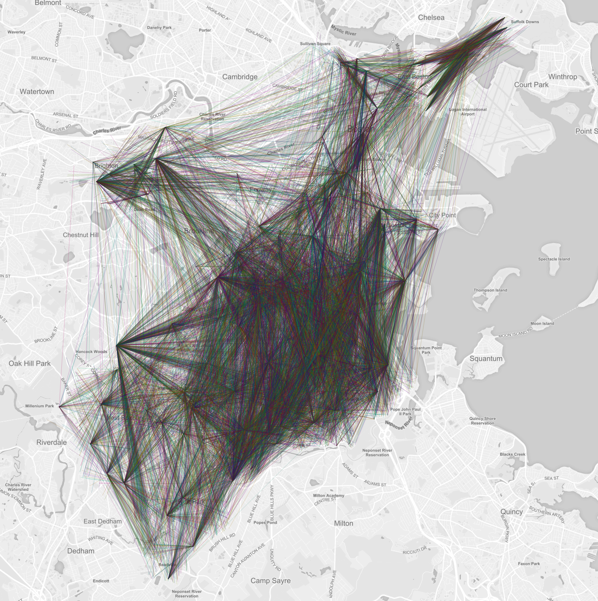

# Simulated Student Data for Boston Public Schools
Tool for automatically generating simulated data sets of Boston Public Schools students and their school assignments.

## Usage

To install all requirements:

    python -m pip install -r requirements.txt

To execute the script and generate a data set:

    python generate-student-data.py

## Example Output

## Sources

* [Zip codes](http://www.mass.gov/anf/research-and-tech/it-serv-and-support/application-serv/office-of-geographic-information-massgis/datalayers/zipcodes.html) from `mass.gov`
* [Boston family household data](https://www.bostonplans.org/getattachment/caf0d3fb-951d-4b0a-9181-9b41cdf59cf8) frpm `bostonplans.org`
* [Children per household](https://nces.ed.gov/programs/digest/d15/tables/dt15_102.10.asp?current=yes) from `ed.gov`
